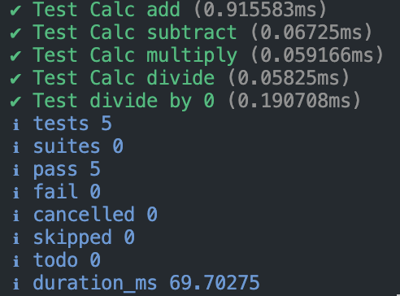
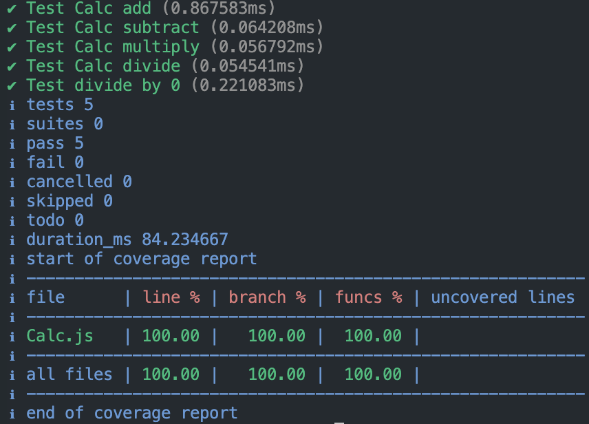

# TDD (Test Driven Development) 
- write failing tests for each function (subtract, multiply, divide) - **Red**
- write code to make tests pass - **Green**
- refactoring if needed

To test run:
``node --test calc_test.js``
or
``node --test --experimental-test-coverage``

Output should be:

or

